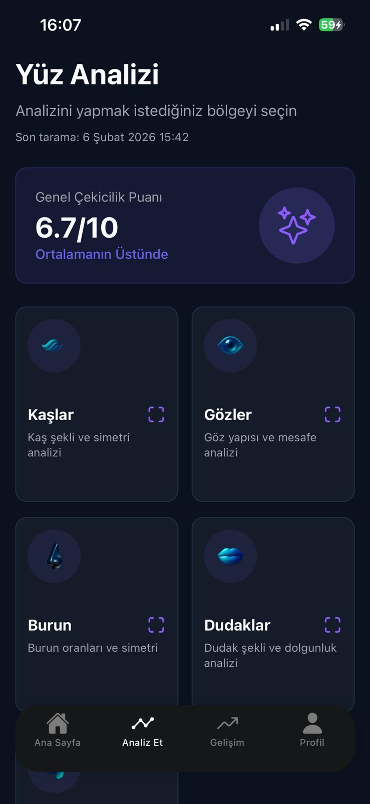
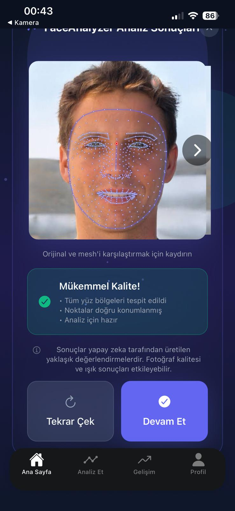
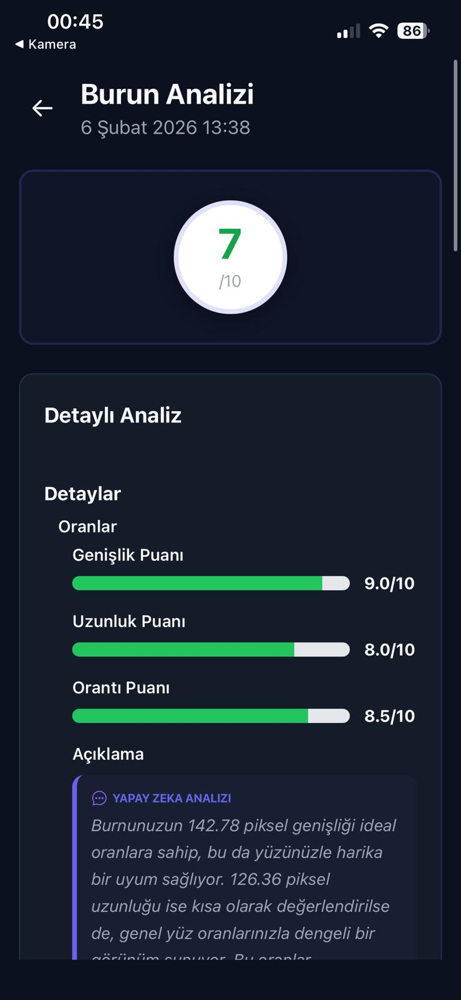
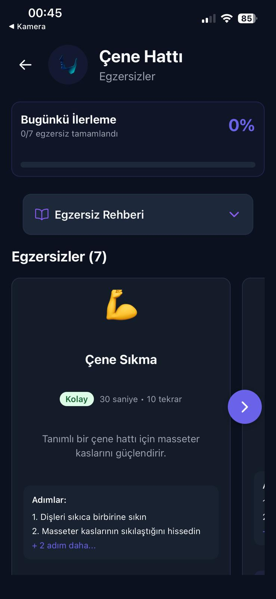
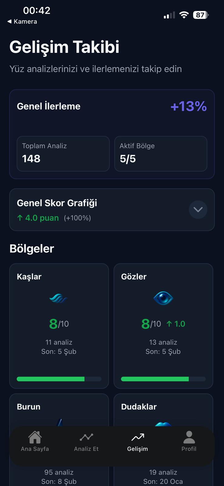

# FaceLoom - AI-Powered Face Analytics 👋

FaceLoom is a cutting-edge mobile application built with **Expo** and **React Native**, designed to provide deep insights into facial aesthetics and health. Using **MediaPipe Face Mesh** technology, FaceLoom scans 468+ facial landmarks to analyze your features with scientific precision.

---

## 📸 Screenshots

<div align="center">
  
  
  
</div>

<div align="center">
  
  
  
</div>

---

## ✨ Key Features

- **🎯 AI Face Scanning**: High-precision landmark detection using MediaPipe.
- **📊 Comprehensive Metrics**: Detailed analysis of eyes, nose, jawline, lips, and facial symmetry.
- **🔄 Consistency Check**: Compare multiple photos to ensure accurate and stable results.
- **🤸 Personalized Exercises**: Targeted facial exercises based on your unique scan results.
- **📈 Progress Tracking**: Monitor your facial changes over time with visual charts.
- **🌐 Multi-Language Support**: Fully localized in English and Turkish.
- **🔐 Secure & Private**: Built-in authentication and secure data storage with Supabase.

---

## 🛠️ Technology Stack

- **Frontend**: [Expo](https://expo.dev), [React Native](https://reactnative.dev), [NativeWind (Tailwind CSS)](https://www.nativewind.dev)
- **AI/ML**: [MediaPipe Face Mesh](https://google.github.io/mediapipe/solutions/face_mesh.html)
- **Backend/Database**: [Supabase](https://supabase.com) (Auth, PostgreSQL, Storage)
- **State Management**: React Context API
- **Animations**: [React Native Reanimated](https://docs.swmansion.com/react-native-reanimated/)
- **Charts**: [React Native Gifted Charts](https://github.com/Abhinandan-Kushal/react-native-gifted-charts)
- **Payments**: [RevenueCat](https://www.revenuecat.com)

---

## 🚀 Getting Started

### 1. Prerequisites
- Node.js (v18 or newer)
- npm or yarn
- Expo Go app on your phone (for testing)

### 2. Installation
```bash
# Clone the repository
git clone https://github.com/mertcantacyildiz/face-scanning-app.git

# Navigate to the project
cd face-scanning-app

# Install dependencies
npm install
```

### 3. Environment Variables
Create a `.env` file in the root directory and add your Supabase credentials:
```env
EXPO_PUBLIC_SUPABASE_URL=your_supabase_url
EXPO_PUBLIC_SUPABASE_ANON_KEY=your_supabase_anon_key
```

### 4. Running the App
```bash
# Start the Expo development server
npx expo start
```
Scan the QR code with your **Expo Go** app (Android) or **Camera** app (iOS).

---

## 📄 License

This project is private and intended for internal use.

---

<p align="center">Created with ❤️ by Mertcan Taçııldız</p>
